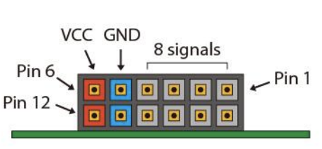
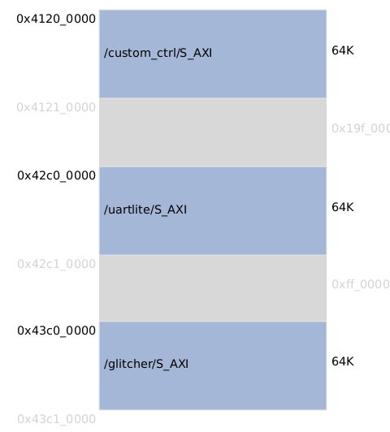

# KRUMKACH-FPGA
**KRUMKACH** is a simple FPGA implementation of a glitchig tool based on PYNQ-Z2 board.

## Features
* UART can be used as trigger event.
* Up to two successive pulses with individual delay can be configured.
* Supports an external trigger event.
* Supports driving a target nRST and may use it as a trigger event.
* Two custom output lines.

## Pinout
**PMODA** is used to expose signals.
| Pin |   Description | IN/OUT | Default |
|----:|---------------|-------:|--------:|
|   1 |   Trigger Ext |     IN |     LOW |
|   2 | Trigger Event |    OUT |     LOW |
|   3 |      Custom_1 |    OUT |     LOW |
|   4 |       UART Tx |    OUT |    HIGH |
|   5 |           GND |        |         |
|   6 |           VCC |        |         |
|   7 |        GLITCH |    OUT |     LOW |
|   8 |   Target nRST |    OUT |    HIGH |
|   9 |      Custom_0 |    OUT |     LOW |
|  10 |       UART Rx |     IN |    HIGH |
|  11 |           GND |        |         |
|  12 |           VCC |        |         |

**Trigger Event** is an *action* event without applying delays.
Example: **Trigger Event** will rise when UART trigger message is found in the input.

## Registers
### AXI map
|          Block |   Start address | Size | End Address |
|----------------|-----------------|------|-------------|
| Custom Outputs |   0x4120_0000   |  64K | 0x4120_FFFF |
|       Glitcher |   0x43C0_0000   |  64K | 0x43C0_FFFF |
|       UARTLite |   0x42C0_0000   |  64K | 0x42C0_FFFF |

### Custom Outputs
Standard Xilinx AXI GPIO [block](https://docs.xilinx.com/v/u/en-US/pg144-axi-gpio) where only [1:0] lines are used.
### UARTLite
Standard Xilinx AXI UARTLite [block](https://docs.xilinx.com/v/u/en-US/pg142-axi-uartlite).
| Address Offset | Register Name |        Description |
|---------------:|---------------|--------------------|
|             0h |       Rx FIFO |  Receive data FIFO |
|            04h |       Tx FIFO | Transmit data FIFO |
|            08h |      STAT_REG |   Status register  |
|            0Ch |      CTRL_REG |   Control register |
### Glitcher
Base address is 0x43C0_0000. Each register is 32bit.

**Registers**:
|      Offset |               Description |    R/W | Default |
|------------:|---------------------------|-------:|--------:|
| 0x00 - 0x7C |              UART pattern |     RW |       0 |
|        0x80 |       UART pattern length |     RW |       0 |
|        0x84 |     1st pulse delay value |     RW |     100 |
|        0x88 |     2nd pulse delay value |     RW |     100 |
|        0x8C |         pulse width value |     RW |     100 |
|        0x90 |                   Control |     RW |       0 |
|        0x94 |                    Status |      R |       0 |
|        0x98 |      UART Rx last 4 bytes |      R |       0 |
|        0x9C |                     Debug |      R |       0 |
|        0xA0 |   Target nRST pulse width |     Rw |    1000 |

#### UART patter registers (BASE + 0x00...0x7C)
Defines 128 bytes UART pattern which may be used as a trigger event.
Note: access only via 32bit word. 
#### UART patter length register (BASE + 0x80)
Format:
|           Bits: |     31...7|       6...0|
|----------------:|-----------|------------|
| **Description:**| Reserved  |     length |
#### 1st pulse delay register (BASE + 0x84)
Format:
|           Bits: |      31...0|
|----------------:|------------|
| **Description:**| delay value|
#### 2nd pulse delay register (BASE + 0x88)
Format:
|           bits: |      31...0|
|-----------------|------------|
| **Description:**| delay value|
#### Pulse width register (BASE + 0x8C)
Defines width for 1st and 2nd 
Format:
|           Bits: |      31...0|
|----------------:|------------|
| **Description:**| pulse width|
#### Control register (BASE + 0x90)
Format:
|           Bits: |   31...8|       7 |    6...4|    3...0|
|----------------:|-------------------|---------|--------------|---------|
| **Description:**| Reserved| Disable 2nd pulse | Trigger mode | Run mode|

| Run Mode | Description |
|---------:|-------------|
|     0x0  |        IDLE |
|     0x1  |    Run Once |
|     0x2  |         Run |

| Trigger Mode |         Description |
|-------------:|---------------------|
|         0x0  |                UART |
|         0x1  |    External trigger |
|         0x11 | Target nRST trigger |
#### Status register (BASE + 0x94)
Format:
|           Bits: |   31|                 30|        29...5|        4...0|
|----------------:|-----|-------------------|--------------|-------------|
| **Description:**| Lock| 2nd pulse disabled|      Reserved|       Status|

| Status |                    Description |
|-------:|--------------------------------|
|   0x0  |                        Success |
|   0x1  |              Error: delay is 0 |
|   0x2  | Error: UART pattern lengh is 0 |
|   0x3  |        Error: pulse width is 0 |
|   0x4  |                 Error: Stopped |

#### UART Rx last 4 bytes (BASE + 0x98)
Register is used for debugging UART Rx line. Holds last 4 bytes.
Format:
|           Bits: |        31...24|        23...16|        15...8|        7...0|
|----------------:|---------------|---------------|--------------|-------------|
| **Description:**| Rx byte[-3]| Rx byte[-2]|Rx byte[-1]| Rx byte[0]|
#### Debug register (BASE + 0x9C)
Format:
|           Bits: |        31...11|        10...8|  7...5 |       4...0|
|----------------:|---------------|---------------|--------------|-------------|
| **Description:**| Reserved |Control WR signal sampling| Reserved| State|

| State |           Description |
|------:|-----------------------|
|  0x0  |                  IDLE |
|  0x1  | Wait for UART pattern |
|  0x2  |                 Setup |
|  0x3  |      Wait for Trigger |
|  0x4  |                 Pulse |

#### Target nRST pulse width register (BASE + 0xA0)
Format:
|           Bits: |      31...0|
|----------------:|------------|
| **Description:**| pulse width|
